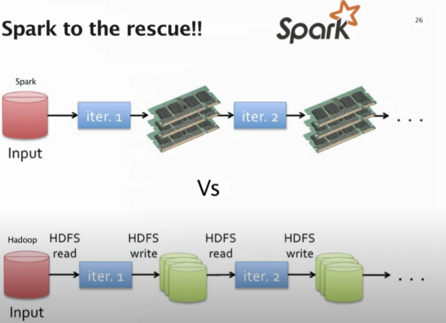

```{r setup, include=FALSE}
knitr::opts_chunk$set(echo = TRUE)
library(rmdformats)
```


## Assignment Instructions
For this discussion item, please watch the talk and summarize what you found to be the most important or interesting points. The first half will cover some of the mathematical techniques covered in this unit's reading and the second half some of the data management challenges in an industrial-scale recommendation system.

Video link: http://www.youtube.com/watch?v=3LBgiFch4_g

In the video referenced above, Christopher Johnson, a machine learning engineer at Spotify, explains the internal workings of Spotify's music recommendation system.
The following is a summary of the most interesting points covered in his talk.

## Mathematical Techniques Utilized by Spotify's Recommendation System
When it comes to recommending music to its users, Spotify mainly relies on collaborative filtering. In the video, the speaker covers 2 mathematical approaches to collaborative filtering - Explicit, and Implicit matrix factorization.

### Explicit Matrix Factorization
This approach to collaborative filtering, utilizes user ratings in order to predict how users will rate new items based on the items that they have already rated. This is one of the approaches utilized by Netflix's recommendation system.


### Implicit Matrix Factorization
In the implicit approach (the approach utilized by Spotify), binary values are used in place of explicit user ratings. Rather than recommending content based on a user's previous ratings, Spotify's recommendation system interprets a user listening to a song as a decision. It then assigns a binary value, a 1 means that the user has streamed a specific song, and a 0 means that they have not streamed a song. Based on this logic, the system can figure out what songs to recommend to the user based on their similarity to those that the user has already streamed (or not streamed).


## Spark Vs Hadoop
The speaker then goes on to cover the differences between Hadoop and Spark, and goes over the advantages Spark holds over Hadoop.

Historically, Spotify relied on Hadoop to handle matrix factorization algorithms and song recommendations. However, due to the fact that Hadoop continuously reads/writes to disk, they were experiencing I/O bottlenecks. This led them to turn to Spark as a solution to this problem.



The advantage of Spark was that they could load the ratings matrix into memory, cache it, and then process the data iteratively without the overhead of reading and writing to disk on each iteration.

They then worked on streamlining their algorithms to reduce processing time. It took them 3 attempts to get this right:

#### First Attempt
The first attempt entailed broadcasting everything. However, this led to the unnecessary shuffling of data during iterations, and thus was deemed an inefficient approach.

#### Second Attempt
The second attempt, know as the "Full Gridfy" method, entailed the ratings matrix being split into K x L partitions, and then cached. this approach removed the need for ratings to be shuffled due to the fact that they were now cached, however a lot of data was sent over the wire during each iteration which resulted in a performance hit.

#### Third Attempt
On the third attempt, Spotify experienced success using the "Half Gridfy" method. This approach involved placing all the ratings for a user into the same block, which resulted in the need for shuffling being reduced.
