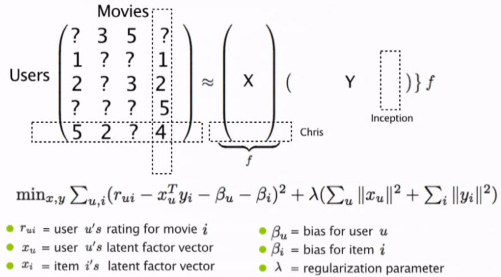
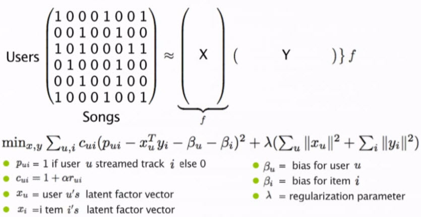

```{r setup, include=FALSE}
knitr::opts_chunk$set(echo = TRUE)
library(rmdformats)
```


## Assignment Instructions
For this discussion item, please watch the talk and summarize what you found to be the most important or interesting points. The first half will cover some of the mathematical techniques covered in this unit's reading and the second half some of the data management challenges in an industrial-scale recommendation system.

Video link: http://www.youtube.com/watch?v=3LBgiFch4_g

In the video referenced above, Christopher Johnson, a machine learning engineer at Spotify, explains the internal workings of Spotify's music recommendation system.
The following is a summary of the most interesting points covered in his talk.

## Mathematical Techniques Utilized by Spotify's Recommendation System
When it comes to recommending music to its users, Spotify mainly relies on collaborative filtering. In the video, the speaker covers 2 mathematical approaches to collaborative filtering - Explicit, and Implicit matrix factorization.

### Explicit Matrix Factorization
This approach to collaborative filtering, utilizes user ratings in order to predict how users will rate new items based on the items that they have already rated. This is one of the approaches utilized by Netflix's recommendation system.




### Implicit Matrix Factorization
In the implicit approach (the approach to collaborative filtering utilized by Spotify), binary values are used in place of explicit user ratings. In the case of Spotify, a 1 means that the user has streamed a specific song, and a 0 means that they have not streamed the song.




